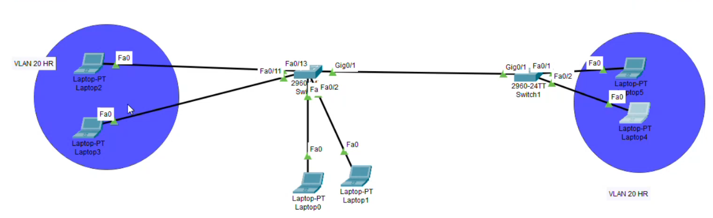
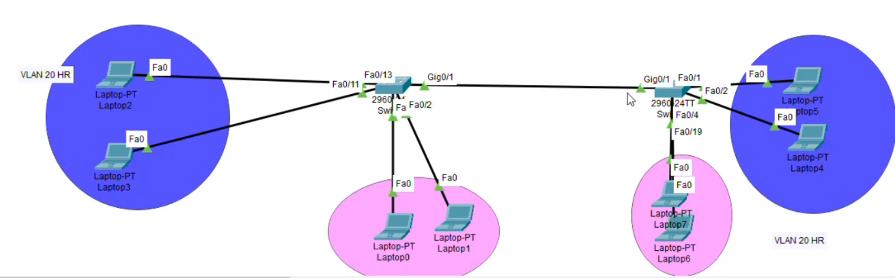

# 1. What is a VLAN?
A **VLAN** allows you to logically divide a single switch into multiple distinct virtual switches.

* **Isolation:** Devices connected to the same switch cannot communicate with each other if they belong to different VLANs, even if they share the same IP address range and Subnet Mask.
* **Layer 2 Operation:** VLANs operate at **Layer 2 (Data Link Layer)** of the OSI model.
* **Default Behavior:** All ports on a switch belong to **VLAN 1** (the Default VLAN).
* Each VLAN is identified by its ID not its name.

---
# 2. VLAN Capacity & ID Ranges
Switches support up to **4094 VLANs**, categorized into standard ranges:

| VLAN ID Range         | Description                                                     |
| :-------------------- | :-------------------------------------------------------------- |
| **VLAN 1**            | Default VLAN (cannot be deleted or renamed).                    |
| **VLANs 2 – 1001**    | Normal Range (used for custom administrative VLANs).            |
| **VLANs 1002 – 1005** | Reserved by default (legacy technologies like Token Ring/FDDI). |
| **VLANs 1006 – 4094** | Extended Range.                                                 |

---

# 3. VLAN Basic Configuration
### 3.1 Creating VLANs & Assigning Ports
```
enable
configure terminal

! Create VLAN 10 and give it a name
vlan 10
 name IT // By default , its name is 0010 and so on
exit

! Create VLAN 20 and give it a name
vlan 20
 name HR
exit

! Assign a range of ports to VLAN 10
interface range f0/1 - 5
 switchport access vlan 10
exit

! Assign a range of ports to VLAN 20
interface range f0/10 - 15
 switchport access vlan 20
exit
```

- If you assign an interface to a VLAN ID that does not exist yet, the switch creates it automatically:
```
interface range f0/20 - 24
switchport access vlan 30  ! VLAN 30 is created automatically named VLAN0030
exit
```
##### Verification Commands
- `show vlan` : Displays detailed information about all active VLANs.
- `show vlan brief` : Displays a summary table of all VLANs and their assigned ports.
### 3.2 Removing a Port from a Custom VLAN
- Removing an explicit VLAN port assignment returns the port back to its default state (**VLAN 1**):
  ```
  interface f0/24
  no switchport access vlan 10
  exit
  ```
### 3.3 Deleting VLANs 
##### 3.3.1 Deleting a VLAN
```
enable
configure terminal
no vlan 7
exit
```
- **Important Warning ("Homeless Ports"):** When you delete a VLAN, any switch ports assigned to it **do not** automatically return to VLAN 1. Instead, they become **inactive ("homeless")** and lose all connectivity until you manually reassign them to an active VLAN or recreate the missing VLAN ID.
##### 3.3.2 Restoring Inactive Ports
- If you recreate a deleted VLAN ID, any ports previously assigned to that ID instantly regain their connectivity, regardless of the new name given to the VLAN:
  ```
  vlan 7  ! Re-creates VLAN 7; previously assigned ports rejoin automatically
  exit
  ```
  
---
# 4. How Switches Store VLAN Data
- **`vlan.dat`:** VLAN configurations are saved in a separate database file stored in the switch's flash memory (`flash:vlan.dat`).
- **Deleting All VLANs:** To completely remove all custom VLANs and reset the switch to its default state, you must delete the `vlan.dat` file from flash memory using the `delete flash:vlan.dat` command and `reload` the switch.
- **`config.text`:** Main system configurations (e.g., hostnames, IP addresses, interface settings) are saved in startup memory separately from `vlan.dat`.
---
# 5. Switch Port Modes
### 5.1 Overview of Switch Port Operational Modes
Network switches operate using two primary port operational modes to control traffic flow across VLANs:
* **Access Mode:** Connects a switch port to an end device (e.g., PC, laptop, printer). An access port carries traffic for **only one single VLAN**.
* **Trunk Mode:** Connects a switch port to another network switch or router. A trunk port carries traffic for **multiple VLANs simultaneously** across a single physical link.
### 5.2 Why Trunking is Required Between Switches
#### Scenario A: Connecting a Single VLAN Across Switches

Consider two switches (`Switch0` and `Switch1`) where hosts in **VLAN 20** reside on both switches. 
* By default, inter-switch interconnect ports (e.g., `Gig0/1`) belong to **VLAN 1**. Therefore, hosts in VLAN 20 on `Switch0` cannot communicate across `Gig0/1` because the interconnect port is in a different VLAN.
* **Workaround:** Manually assigning `Gig0/1` on both switches to VLAN 20 allows VLAN 20 traffic to traverse the link. However, this link is now dedicated exclusively to VLAN 20.
#### Scenario B: Connecting Multiple VLANs Across Switches

If your network contains multiple VLANs (e.g., VLAN 10 and VLAN 20) spread across both switches:
* Assigning the interconnect link to a single access VLAN fails because it cannot carry traffic for other VLANs.
* Dedicated physical links for every single VLAN quickly exhausts available switch ports.
#### The Solution: Trunk Links & Frame Tagging
Configuring the interconnect link (`Gig0/1` on both switches) as a **Trunk** allows a single physical cable to multiplex traffic from all VLANs.
* **VLAN Tagging (IEEE 802.1Q):** Trunk interfaces append a 4-byte VLAN ID tag to Ethernet frames before sending them across the link. The receiving switch reads the tag, strips it off, and forwards the frame to the target VLAN.
* **Note on Inter-VLAN Routing:** Trunking allows traffic from the *same* VLAN to cross switches. To allow communication *between* different VLANs (e.g., VLAN 10 communicating with VLAN 20), a Layer 3 device (Router or Layer 3 Switch) is required for routing.
### 5.3 Dynamic Trunking Protocol (DTP) & Port Modes
Cisco switches support **Dynamic Trunking Protocol (DTP)** to automatically negotiate whether a port operates in **Access** or **Trunk** mode with its connected peer.
#### Switchport Mode Options
```text
Switch>en
Switch#conf t
Switch(config)#int g0/1
Switch(config-if)# switchport mode ?
  access   Set trunking mode to ACCESS unconditionally
  dynamic  Set trunking mode to dynamically negotiate access or trunk mode
  trunk    Set trunking mode to TRUNK unconditionally
```
When choosing `dynamic`, two negotiation sub-modes are available:
```
Switch(config-if)# switchport mode dynamic ?
  auto       Set trunking mode dynamic negotiation parameter to AUTO
  desirable  Set trunking mode dynamic negotiation parameter to DESIRABLE
```
- **Dynamic Auto (Passive):** The port prefers to become an **Access** port. It passively listens for DTP negotiation frames but does not actively initiate negotiation.
- **Dynamic Desirable (Active):** The port actively sends DTP negotiation frames to the far end to establish a **Trunk** link.
### 5.4 DTP Negotiation Matrix (Port Combinations)
The operational link type depends on the mode configured on both ends of the cable:

| Local Port Mode            | Dynamic Auto (DA)             | Dynamic Desirable (DD)   | Access                           | Trunk                            |
| -------------------------- | ----------------------------- | ------------------------ | -------------------------------- | -------------------------------- |
| **Dynamic Auto (DA)**      | **Access** _(No Negotiation)_ | **Trunk** _(Negotiated)_ | **Access** _(No Negotiation)_    | **Trunk** _(No Negotiation)_     |
| **Dynamic Desirable (DD)** | **Trunk** _(Negotiated)_      | **Trunk** _(Negotiated)_ | **Access** _(Mismatch)_          | **Trunk** _(Mismatch)_           |
| **Access**                 | **Access** _(No Negotiation)_ | **Access** _(Mismatch)_  | **Access**                       | **Link Down / Misconfiguration** |
| **Trunk**                  | **Trunk** _(No Negotiation)_  | **Trunk** _(Mismatch)_   | **Link Down / Misconfiguration** | **Trunk**                        |
**Key Takeaway:**
- **Auto + Auto** results in an **Access link**.
- **Desirable + Auto** or **Desirable + Desirable** negotiates into a **Trunk link**.
- **Access + Trunk** creates a mode mismatch that disrupts proper frame delivery and generates configuration error messages.
### 5.5 Configuration & Verification Commands
#### Configuring a Static Trunk Port
```
Switch# configure terminal
Switch(config)# interface gigabitethernet 0/1
Switch(config-if)# switchport mode trunk
Switch(config-if)# exit
```
#### Verification Command
To verify active trunking interfaces, operational status, and negotiated DTP modes:
```
Switch# show interfaces trunk
```
**Sample Output:**
```
Port        Mode         Encapsulation  Status        Native vlan
Gi0/1       desirable    802.1q         trunking      1

Port        Vlans allowed on trunk
Gi0/1       1-4094
```
 
--- 
# 6. Native VLANs and Allowed VLANs on Trunk Links

### 6.1 Native VLAN Concepts

<br>
A **Native VLAN** is a VLAN on an 802.1Q trunk port that handles **untagged traffic**. 
* **Untagged Transmission:** When a frame belongs to the Native VLAN, the sending switch transmits it across the trunk link *without* attaching an 802.1Q header tag.
* **Receiving Behavior:** When the receiving switch accepts an untagged frame on a trunk interface, it automatically forwards that frame to its configured Native VLAN.
* **Efficiency:** Because 802.1Q tags are not attached or stripped for this specific VLAN, overhead and processing cycles are reduced.
* **Single Native VLAN Limit:** Each trunk link can support only **one** Native VLAN.
* **Default Setting:** By default, **VLAN 1** serves as the Native VLAN on all Cisco switch trunk ports unless explicitly reconfigured.
### 6.2 Configuring and Matching the Native VLAN
For proper traffic flow, **both switches connected via a trunk link must be configured with the exact same Native VLAN**. 

> **Warning:** A Native VLAN mismatch (e.g., Switch 0 configured with VLAN 20 and Switch 1 configured with VLAN 1) causes CDP (Cisco Discovery Protocol) errors, traffic leaks between different VLANs, and potential routing loops.

#### Configuration Example

##### On Switch 0:
```text
Switch0> enable
Switch0# configure terminal
Switch0(config)# interface gigabitethernet 0/1
Switch0(config-if)# switchport mode trunk
Switch0(config-if)# switchport trunk native vlan 20
Switch0(config-if)# exit
```
##### On Switch 1:
```
Switch1> enable
Switch1# configure terminal
Switch1(config)# interface gigabitethernet 0/1
Switch1(config-if)# switchport mode trunk
Switch1(config-if)# switchport trunk native vlan 20
Switch1(config-if)# exit
```

### 6.3 Allowed VLANs on a Trunk Interface
#### What is the Allowed VLAN List?
By default, a trunk link carries traffic for **all active VLANs** (VLAN 1 through 4094). The **Allowed VLANs** feature restricts which specific VLANs are permitted to transmit traffic across that physical trunk interface.
#### Key Use Cases
1. **Security Hardening:** Prevents unauthorized VLAN traffic from traversing trunk cables to switches where those VLANs are not needed.
2. **Bandwidth & Performance Optimization:** Restricts unnecessary broadcast, multicast, and unknown unicast traffic from flooding across links to remote switches that do not host members of those specific VLANs.
### 6.4 Configuring Allowed VLANs
Cisco CLI provides several options to define or modify the allowed VLAN list on a trunk:
```
Switch1> enable
Switch1# configure terminal
Switch1(config)# interface gigabitethernet 0/1
Switch1(config-if)# switchport trunk allowed vlan ?
  WORD    VLAN IDs of the allowed VLANs when this port is in trunking mode (e.g., 10,20,30)
  add     Add VLANs to the current allowed list
  all     Allow all VLANs across the trunk
  except  Allow all VLANs except the specified IDs
  none    Block all VLANs across the trunk
  remove  Remove specific VLANs from the current allowed list
```
#### Configuration Examples
- **Set a specific explicit list (overwrites current list):**
    ```
    Switch1(config-if)# switchport trunk allowed vlan 10,20,30
    ```
- **Add a VLAN to an existing allowed list:**
    ```
    Switch1(config-if)# switchport trunk allowed vlan add 40
    ```
- **Remove a specific VLAN from the allowed list:**
    ```
    Switch1(config-if)# switchport trunk allowed vlan remove 10
    ```