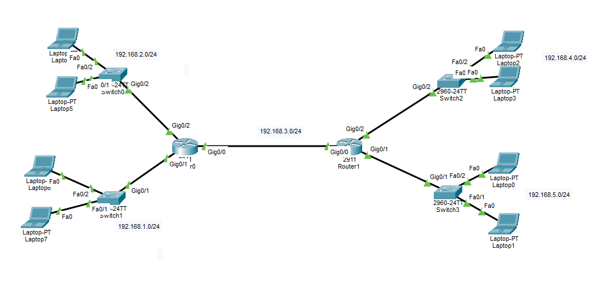

# 1. EIGRP — Enhanced Interior Gateway Routing Protocol
- EIGRP is a interior dynamic routing protocol used inside an organization.
- Routers that use EIGRP share routing information with each other.
- EIGRP does not send its full routing table every 30 or 90 seconds. I**t sends routing updates when the network changes.**
- For example, it sends an update when:
	- A new network appears.
	- A route goes down.
	- A better path becomes available.
	- A router loses a connection.
- EIGRP also sends Hello packets regularly to check whether neighboring routers are still working.
---
# 2. EIGRP Multicast Address
- EIGRP uses this multicast IP address:
```text
224.0.0.10
````
- Multicast means sending one packet to a specific group of devices.
- In this case, EIGRP sends packets only to routers that are listening for EIGRP messages.
- It does not send the packets to every device on the network.
---
# 3. EIGRP Administrative Distance
- The **Administrative Distance** of an internal EIGRP route is:
```text
90
```
- Administrative Distance is used when a router learns the same destination from more than one routing source.

- A lower Administrative Distance is preferred.
- For example, if the router learns the same route from two protocols:
```text
Protocol 1 AD: 90
Protocol 2 AD: 120
```
- The router chooses the route with an AD of `90` because it is lower.
---
# 4. Subnet Mask and Wildcard Mask
- A subnet mask and a wildcard mask are related, but they are used differently.
## Subnet Mask
- A subnet mask tells us which part of an IP address is the network part and which part is the device part.
- Example:
```text
IP address:  192.168.1.0
Subnet mask: 255.255.255.0
```
- The subnet mask `255.255.255.0` means:
	- The first three parts identify the network.
	- The last part can contain device addresses.
- This subnet is also written as:
```text
192.168.1.0/24
```
## Wildcard Mask
- A wildcard mask is the opposite of a subnet mask.
- Example:
```text
Subnet mask:  255.255.255.0
Wildcard mask: 0.0.0.255
```
- To find the wildcard mask, subtract every subnet mask number from `255`.
- Example:
```text
255 - 255 = 0
255 - 255 = 0
255 - 255 = 0
255 - 0   = 255
```
- So:
```text
Subnet mask:   255.255.255.0
Wildcard mask: 0.0.0.255
```
### Meaning of the Wildcard Mask
- In a wildcard mask:
	- `0` means the value must match.
	- `255` means the value can be different.

- Example:
```text
Network:       192.168.1.0
Wildcard mask: 0.0.0.255
```
- This means:
	- `192` must match.
	- `168` must match.
	- `1` must match.
	- The last number can be from `0` to `255`.
- This matches addresses in Network `192.168.1.0/24`.
## Main Difference Between Subnet Mask & Wild Card
- **The subnet mask is normally used when giving an IP address to an interface.**
- Example:
```text
Router(config-if)#ip address 192.168.1.1 255.255.255.0
```
- **The wildcard mask can be used with the EIGRP `network` command.**
- Example:
```text
Router(config-router)#network 192.168.1.0 0.0.0.255
```

---
# 5. EIGRP Configuration

- In this example, we use Class C networks with the default `/24` mask, so the command can be written without the wildcard mask.
- Example:
```text
Router(config-router)#network 192.168.1.0
```
- You can also write it with the wildcard mask:
```text
Router(config-router)#network 192.168.1.0 0.0.0.255
```
## EIGRP Autonomous System Number
- EIGRP requires an **Autonomous System number**.
- The number is written when EIGRP is enabled:
```text
Router(config)#router eigrp 11
```

- All routers that need to become EIGRP neighbors **must use the same EIGRP Autonomous System number**.
- For example, if an organization uses EIGRP AS number `10`, every router in that EIGRP network should use:
```text
Router(config)#router eigrp 10
```
### What Happens If Routers Use Different AS Numbers?
- Routers using different EIGRP AS numbers **will not become EIGRP neighbors**.
- For example:
```text
Router0: router eigrp 10
Router1: router eigrp 20
```
- Router0 and Router1 will treat the EIGRP processes as **different routing groups**. They will not exchange EIGRP routes with each other.
## Network Topology
- We will use the same topology that was used in the RIP example.
- Router0 is connected to:
	- Network `192.168.1.0/24`
	- Network `192.168.2.0/24`
	- Network `192.168.3.0/24`
- Router1 is connected to:
	- Network `192.168.3.0/24`
	- Network `192.168.4.0/24`
	- Network `192.168.5.0/24`
- Network `192.168.3.0/24` connects Router0 and Router1.
- Both routers will use EIGRP Autonomous System number:
```text
11
```
## Step 1: Router0 Configuration
- We will use the default subnet mask, so we will not write a wildcard mask.
```text
Router(config)#router eigrp 11
Router(config-router)#network 192.168.1.0
Router(config-router)#network 192.168.2.0
Router(config-router)#network 192.168.3.0
Router(config-router)#passive-interface g0/1
Router(config-router)#passive-interface g0/2
```
## Step 2: Router1 Configuration
```text
Router(config)#router eigrp 11
Router(config-router)#network 192.168.3.0
Router(config-router)#network 192.168.4.0
Router(config-router)#network 192.168.5.0
Router(config-router)#passive-interface g0/1
Router(config-router)#passive-interface g0/2
```
## Step 3: Testing EIGRP
- After EIGRP is configured, the routing table for router0 may show:
```text
Router# show ip route

D    192.168.4.0/24 [90/3072] via 192.168.3.1, 00:02:23, GigabitEthernet0/0
D    192.168.5.0/24 [90/3072] via 192.168.3.1, 00:02:23, GigabitEthernet0/0
```
- The letter `D` means that the route was learned through EIGRP.

- Example:
```text
D 192.168.4.0/24 [90/3072] via 192.168.3.1
```
- This means:
	- `D` means the route was learned through EIGRP.
	- `192.168.4.0/24` is the destination network.
	- `90` is the Administrative Distance.
	- `3072` is the EIGRP metric.(It is calculated with specific formula)
	- `192.168.3.1` is the next-hop router.
	- `GigabitEthernet0/0` is the interface used to reach the destination.
## Removing EIGRP
- To stop and remove the EIGRP process, use:
```text
Router(config)#no router eigrp 11
```
- The number must match the EIGRP Autonomous System number that was configured.
- After removing it:
	- EIGRP neighbor relationships are removed.
	- EIGRP routes are removed from the routing table.
	- The router stops sending EIGRP messages for AS `11`.