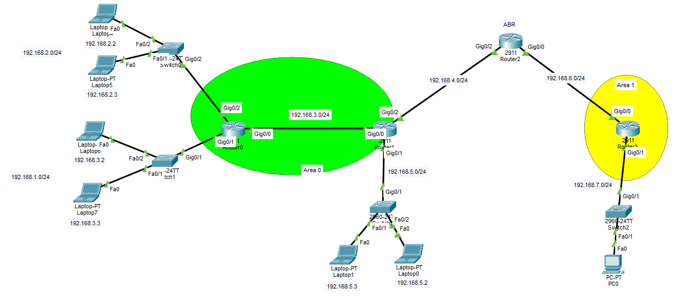

# 1. OSPF — Open Shortest Path First
- OSPF stands for **Open Shortest Path First**.
- OSPF is a interior dynamic routing protocol used inside an organization.
- OSPF routers share information about their links and networks. Each router uses this information to build a map of the network and choose the path with the lowest cost.
- The Administrative Distance of OSPF is: `110` , a lower Administrative Distance is preferred.
- OSPF uses a wildcard mask with the `network` command.
---
# 2. Multicast Addresses
- OSPF uses two multicast IP addresses:
```text
224.0.0.5
224.0.0.6
```
## Address `224.0.0.5`
- This address means:
```text
All OSPF Routers
```
- OSPF routers can send packets to this address to reach all OSPF routers on the local network.
## Address `224.0.0.6`
- This address means:
```text
All Designated Routers
```
- It is mainly used to send OSPF information to the DR and BDR on a network where DR and BDR are used.
---
# 3. OSPF Areas
- An **OSPF area** is a **group of routers and networks inside one OSPF system**.
- An area helps **divide a large OSPF network into smaller parts**.
- Routers inside an area **keep detailed information about that area**.
- They do not always need every small detail from every other area.
- The most important OSPF area is **Area 0**.
- Area 0 is called the **backbone area**.
## Why Do We Use Areas?
- Areas help with:
	- Reducing the size of the OSPF database.
	- Reducing the amount of routing information sent between routers.
	- Reducing the router's CPU work.
	- Reducing memory use.
	- Making a large OSPF network easier to manage.
	- Keeping some network changes inside one area.
- Without areas, every router in a large OSPF network may need to process information about the whole network.
# 4. DR and BDR
- Imagine **several OSPF routers are connected to the same switch (called shared network)**.
- Without a DR, every router would need to exchange routing information directly with every other router. **This creates many connections and extra traffic.**
- So OSPF chooses:
	- **DR:** the main router that collects and shares OSPF information.
	- **BDR:** the backup router that takes over if the DR fails.
## DR
- DR means:
```text
Designated Router
```
- On a shared network, all OSPF routers **do not need to send the same information directly to every other router**.
- Instead:
	1. The other routers send their OSPF updates to the **DR**.
	2. The DR shares that information with the other routers.
	3. The **BDR** stays ready in case the DR stops working.
- Without a DR, Router1, Router2, and Router3 would each need to exchange information **directly** with one another.
- With a DR, most of the exchange goes through one main router, so there are **fewer OSPF connections and less repeated traffic**.
- The DR is only the coordinator for that shared network, **not for the whole OSPF area**.
- An OSPF area may contain:
	- No DR.
	- One DR and one BDR.
	- More than one DR and BDR pair if the area contains several shared network segments.
## BDR
- BDR means:
```text
Backup Designated Router
```
- The BDR watches the DR and is ready to replace it.
- If the DR fails:
	1. The BDR becomes the new DR.
	2. Another router may be elected as the new BDR.
- This reduces the time needed to recover from a DR failure.
## DR and BDR Priority Election
- OSPF **first** checks the **interface priority**.
- The default OSPF interface priority is `1`.
- The router with the **highest priority** is preferred as the **DR**.
- The router with the **second-highest** priority is preferred as the **BDR**.
### Changing OSPF Priority
- You can change OSPF priority **on an interface**.
- Example:
```text
Router(config)#interface g0/0
Router(config-if)#ip ospf priority 100
```
- A higher priority gives the router a better chance of becoming the DR or BDR.
- The priority can be from `0 to 255`
- A priority of `0` means that **the router can still use OSPF, but it will not become the DR or BDR on that network**.
### Important Note
- The election is normally **non-preemptive**.
- This means that after a DR and BDR are elected, a new router with a higher priority or higher Router ID **does not automatically replace the current DR or BDR**.
- A new election normally happens **when the current DR or BDR fails** or **when the OSPF process or interface is restarted**.
# 5. OSPF Router ID Election
- A **Router ID** is a 32-bit number that **identifies an OSPF router**.
- It has the same written form as an IPv4 address `1.1.1.1`.
- If routers have **the same priority**, OSPF **uses the Router ID as a tie-breaker**:
	- The **highest Router ID** becomes the **DR**.
	- The **second-highest** Router ID becomes the **BDR**.
- The Router ID does not have to be a real address used to send normal user traffic. **It is mainly used to identify the router inside OSPF**.
- Example:
```text
Router0 priority: 1
Router0 Router ID: 1.1.1.1

Router1 priority: 1
Router1 Router ID: 2.2.2.2
```
- **Both routers have the same priority**.
- Router1 has **the higher Router ID**:
```text
2.2.2.2
```
- Therefore, Router1 is preferred as the DR.
- The Router ID is used for several OSPF tasks, including:
	- Identifying the router.
	- Building neighbor relationships.
	- Identifying information sent by the router.
	- Breaking a tie during DR and BDR elections.
## How OSPF Chooses the Router ID
- A Cisco router normally chooses its OSPF Router ID **in this order**:
	1. A Router ID configured **manually**.
	2. The **highest IP** address **on a loopback interface**.
	3. The **highest active IP** address on a **physical interface**.

- A manually configured Router ID has the highest priority in this choice.
- Example:
```text
Router(config)#router ospf 1
Router(config-router)#router-id 1.1.1.1
```
### Loopback Interface
- A loopback interface is a **logical interface inside the router**,It is not connected to a physical cable.
- This creates Loopback interface number `2`:
```text
Router(config)#interface loopback 2
```

- You must also give it an IP address **if you want OSPF to use its IP address as a Router ID**:
```text
Router(config)#interface loopback 2
Router(config-if)#ip address 2.2.2.2 255.255.255.255
Router(config-if)#exit
```

- If no Router ID is manually configured and there are no loopback interfaces, the router uses the highest active physical interface IP address as its Router ID.
### Why Does OSPF Prefer a Loopback Address Over a Physical Address?
- A loopback interface is **more stable** than a physical interface.
- **A physical interface can go down** because of:
	- A broken cable.
	- A switch failure.
	- A port shutdown.
	- A hardware problem.
	- A lost connection.
- A loopback interface is **logical**. It normally **stays active while the router is running**.
- Because of this, a loopback address is a better choice for the Router ID.
- A stable Router ID helps avoid changes inside OSPF.
### What Does “Highest IP Address” Mean?
- The highest IP address means the address with the **largest numeric value**.
- OSPF compares the address as one 32-bit number, from left to right.
- Compare these addresses:
```text
192.168.1.1
192.168.2.1
```
- The higher address is:
```text
192.168.2.1
```
- This is because the first two parts are equal:
```text
192.168
```
- The third part is then compared:
```text
2 > 1
```

# 6. OSPF Metric
- OSPF calls its metric:
```text
Cost
```
- OSPF prefers the path with the **lowest total cost**.
- The default cost formula is commonly written as:
```text
Cost = Reference Bandwidth / Interface Bandwidth
```

- On many Cisco routers, the **default reference bandwidth** is:
```text
100,000,000 bits per second
```
- This is also written as:
```text
10^8
```

- The formula can therefore be written as:
```text
Cost = 10^8 / Bandwidth in bits per second
```

## What Is Bandwidth?
- Bandwidth means the **data capacity of a network link**.
- It describes **how much data the link can carry in one second**.
- Common examples are: 10 Mbps, 100 Mbps, 1 Gbps.

- A link with higher bandwidth normally receives a lower OSPF cost. (Bandwidth is denominator)
- A link with lower bandwidth normally receives a higher OSPF cost. (Bandwidth is denominator)
- Because OSPF prefers lower cost, it normally prefers faster links.

## Metric Examples
- 10 Mbps Link:
```text
Cost = 100,000,000 / 10,000,000
Cost = 10
```
- 100 Mbps Link:
```text
Cost = 100,000,000 / 100,000,000
Cost = 1
```
- 1 Gbps Link:
```text
Cost = 100,000,000 / 1,000,000,000
Cost = 0.1
```

- However, the normal **minimum OSPF interface cost** is `1`.
- Therefore, a 1 Gbps link also receives a cost of `1` with the default reference bandwidth.
- This means that **the default value may not show a difference between 100 Mbps, 1 Gbps, and faster links**.
- The reference bandwidth can be changed in a real network so OSPF can tell the difference between faster links.

## Total Path Cost
- **OSPF adds the outgoing interface costs along the path.**
- Example:
```text
Router0 ---- Router1 ---- Destination Network
```
- Suppose each outgoing link has a cost of `1`. The total route cost may be:
```text
1 + 1 = 2
```
- That is why a routing-table entry may show:
```text
[110/2]
```
- This means:
```text
110 = Administrative Distance
2   = Total OSPF cost
```

---

# 7. OSPF Single-Area Configuration

- Router0 and Router1 are in Area 0.
- Network `192.168.3.0/24` connects the two routers.
- Router0 has Networks 1 and 2.
- Router1 has Networks 4 and 5.
- The networks are:
```text
192.168.1.0/24
192.168.2.0/24
192.168.3.0/24
192.168.4.0/24
192.168.5.0/24
```
## 7.1 OSPF Process ID
- **OSPF requires a Process ID when it is started.**
- Example:
```text
Router(config)#router ospf 1
```
- The **Process ID** in this command is:
```text
1
```
- The Process ID is **local to the router**. This means that two OSPF routers **do not have to use the same Process ID**.
## 7.2 Router0 Configuration
```text
Router(config)#router ospf 1
Router(config-router)#network 192.168.1.0 ?
  A.B.C.D  OSPF wild card bits

Router(config-router)#network 192.168.1.0 0.0.0.255 ?
  area  Set the OSPF area ID

Router(config-router)#network 192.168.1.0 0.0.0.255 area ?
  <0-4294967295>  OSPF area ID as a decimal value
  A.B.C.D         OSPF area ID in IP address format

Router(config-router)#network 192.168.1.0 0.0.0.255 area 0
Router(config-router)#network 192.168.2.0 0.0.0.255 area 0
Router(config-router)#network 192.168.3.0 0.0.0.255 area 0
Router(config-router)#passive-interface g0/1
Router(config-router)#passive-interface g0/2
Router(config-router)#ex
Router(config)#
```
### Router0 Command Explanation
- This command starts OSPF process `1`:
```text
Router(config)#router ospf 1
```
- This command enables OSPF on the interface that matches Network `192.168.1.0/24` and **places it in Area 0**:
```text
Router(config-router)#network 192.168.1.0 0.0.0.255 area 0
```
- This command does the same for Network `192.168.2.0/24`:
```text
Router(config-router)#network 192.168.2.0 0.0.0.255 area 0
```
- This command **enables OSPF** on the connection between Router0 and Router1:
```text
Router(config-router)#network 192.168.3.0 0.0.0.255 area 0
```
- Network `192.168.3.0/24` is important because the routers use it to become OSPF neighbors.
## 7.3 Router1 Configuration
```text
Router(config)#router ospf 1
Router(config-router)#network 192.168.3.0 0.0.0.255 area 0
Router(config-router)#network 192.168.4.0 0.0.0.255 area 0
Router(config-router)#network 192.168.5.0 0.0.0.255 area 0
Router(config-router)#passive-interface g0/1
Router(config-router)#passive-interface g0/2
Router(config-router)#ex
```
## 7.4 Testing OSPF
### Show Active Routing Protocols
```text
show ip protocols
```
- This command **shows the routing protocols running on the router**.
- It can show information such as:
	- OSPF Process ID.
	- Router ID.
	- Advertised networks.
	- Passive interfaces.
	- Routing sources.
	- Other configured routing protocols.
### Show the Routing Table
```text
show ip route
```
- Routes learned through OSPF may begin with `O` Letter:
#### Router0 Routing Table
```text
     192.168.1.0/24 is variably subnetted, 2 subnets, 2 masks
C       192.168.1.0/24 is directly connected, GigabitEthernet0/1
L       192.168.1.1/32 is directly connected, GigabitEthernet0/1
     192.168.2.0/24 is variably subnetted, 2 subnets, 2 masks
C       192.168.2.0/24 is directly connected, GigabitEthernet0/2
L       192.168.2.1/32 is directly connected, GigabitEthernet0/2
     192.168.3.0/24 is variably subnetted, 2 subnets, 2 masks
C       192.168.3.0/24 is directly connected, GigabitEthernet0/0
L       192.168.3.1/32 is directly connected, GigabitEthernet0/0
O    192.168.4.0/24 [110/2] via 192.168.3.2, 00:05:53, GigabitEthernet0/0
O    192.168.5.0/24 [110/2] via 192.168.3.2, 00:05:43, GigabitEthernet0/0
```
##### Meaning of the Route
- Example:
```text
O 192.168.4.0/24 [110/2] via 192.168.3.2
```
- This means:
	- `O` means the route was learned through OSPF.
	- `192.168.4.0/24` is the destination network.
	- `110` is the OSPF Administrative Distance.
	- `2` is the total OSPF cost.
	- `192.168.3.2` is the next-hop router.
	- `GigabitEthernet0/0` is the exit interface.

# 8. OSPF Multi-Area Configuration
- **A multi-area OSPF network contains more than one area.**

- In this topology:
	- Router0 and Router1 are in Area 0.
	- Router2 connects Area 0 and Area 1.
	- Router2 is the ABR.
	- Router3 is inside Area 1.
	- Network `192.168.4.0/24` connects Router1 to Router2.
	- Network `192.168.6.0/24` connects Router2 to Router3.
	- Network `192.168.7.0/24` is the user network behind Router3.
## 8.1 Router1 Configuration — Area 0
```text
Router(config)#router ospf 1
Router(config-router)#network 192.168.3.0 0.0.0.255 area 0
Router(config-router)#network 192.168.4.0 0.0.0.255 area 0
Router(config-router)#network 192.168.5.0 0.0.0.255 area 0
Router(config-router)#passive-interface g0/1
Router(config-router)#ex
```
## 8.2 Router3 (Yellow Router) Configuration — Area 1
```text
Router(config)#router ospf 1
Router(config-router)#network 192.168.6.0 0.0.0.255 area 1
Router(config-router)#network 192.168.7.0 0.0.0.255 area 1
Router(config-router)#passive-interface g0/1
Router(config-router)#ex
```
## 8.3 Router2 Configuration — ABR
```text
Router(config)#router ospf 1
Router(config-router)#network 192.168.4.0 0.0.0.255 area 0
Router(config-router)#network 192.168.6.0 0.0.0.255 area 1
Router(config-router)#ex
```
- **Area numbers is very important in these commands.**
### Why Is Router2 an ABR?
- ABR means **Area Border Router**
- An ABR **connects two or more OSPF areas**.
- **At least one of those areas is normally Area 0**.
- Router2 has **one interface in Area 0**:
```text
192.168.4.0/24 area 0
```
- It also has **one interface in Area 1**:
```text
192.168.6.0/24 area 1
```
- Because it connects two OSPF areas, Router2 is an **Area Border Router**.
- Router2 **shares routing information between Area 0 and Area 1**.
## 8.4 Testing OSPF
### Test the Connection
- From the PC connected to Router3, test the connection to Router0:
```text
ping 192.168.2.1
```
### Router3 Routing Table
- Run:
```text
show ip route
```
- The output may show:
```text
O IA 192.168.1.0/24 [110/4] via 192.168.6.1, 00:03:26, GigabitEthernet0/0
O IA 192.168.2.0/24 [110/4] via 192.168.6.1, 00:03:26, GigabitEthernet0/0
O IA 192.168.3.0/24 [110/3] via 192.168.6.1, 00:03:26, GigabitEthernet0/0
O IA 192.168.4.0/24 [110/2] via 192.168.6.1, 00:22:36, GigabitEthernet0/0
O IA 192.168.5.0/24 [110/3] via 192.168.6.1, 00:03:26, GigabitEthernet0/0
     192.168.6.0/24 is variably subnetted, 2 subnets, 2 masks
C       192.168.6.0/24 is directly connected, GigabitEthernet0/0
L       192.168.6.2/32 is directly connected, GigabitEthernet0/0
     192.168.7.0/24 is variably subnetted, 2 subnets, 2 masks
C       192.168.7.0/24 is directly connected, GigabitEthernet0/1
L       192.168.7.1/32 is directly connected, GigabitEthernet0/1
```

- What Does `O IA` Mean?
```text
O IA
```
- means:
```text
OSPF Inter-Area
```
- `O` means the route was learned through OSPF.
- `IA` means **the destination is in another OSPF area**.

- Router3 is in Area 1.
- Networks such as these are in Area 0:
```text
192.168.1.0/24
192.168.2.0/24
192.168.3.0/24
192.168.4.0/24
192.168.5.0/24
```
- Router3 learns these routes from Router2, which is the ABR.
- Because the routes come from another area, they appear as:
```text
O IA
```
### Router1 Routing Table
```text
O    192.168.1.0/24 [110/2] via 192.168.3.1, 00:49:46, GigabitEthernet0/0
O    192.168.2.0/24 [110/2] via 192.168.3.1, 00:49:46, GigabitEthernet0/0
     192.168.3.0/24 is variably subnetted, 2 subnets, 2 masks
C       192.168.3.0/24 is directly connected, GigabitEthernet0/0
L       192.168.3.2/32 is directly connected, GigabitEthernet0/0
     192.168.4.0/24 is variably subnetted, 2 subnets, 2 masks
C       192.168.4.0/24 is directly connected, GigabitEthernet0/2
L       192.168.4.1/32 is directly connected, GigabitEthernet0/2
     192.168.5.0/24 is variably subnetted, 2 subnets, 2 masks
C       192.168.5.0/24 is directly connected, GigabitEthernet0/1
L       192.168.5.1/32 is directly connected, GigabitEthernet0/1
O IA 192.168.6.0/24 [110/2] via 192.168.4.2, 00:05:57, GigabitEthernet0/2
O IA 192.168.7.0/24 [110/3] via 192.168.4.2, 00:05:57, GigabitEthernet0/2
```

- Router1 is in Area 0.
- These routes are also in Area 0:
```text
O 192.168.1.0/24
O 192.168.2.0/24
```
- Because they come from the same area, they start with:
```text
O
```

- Networks `192.168.6.0/24` and `192.168.7.0/24` are in Area 1.
- Router1 learns them through Router2, the ABR.
- Because they come from another area, they start with:
```text
O IA
```