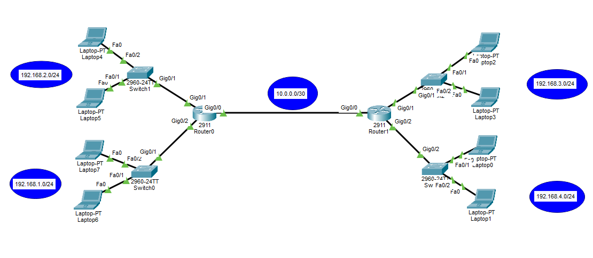

# 1. What is DHCP?
- DHCP stands for **Dynamic Host Configuration Protocol**.
- DHCP is used to **automatically give TCP/IP (network) settings to devices** such as computers, laptops, phones, printers, and other devices.
- DHCP can give a client:
	- IP address
	- Subnet mask
	- Default gateway
	- DNS server
	- Lease time
	- Other DHCP options if needed
- DHCP does not have to give all of these settings.
- For example, DHCP can give only: IP address , Subnet mask without giving a default gateway or DNS server.

- DHCP uses:
	- **UDP port 67** on the DHCP server
	- **UDP port 68** on the DHCP client
- Why UDP?
	- When a client first connects to the network, it does not have an IP address yet. **It needs a simple way to ask for an IP address without first creating a TCP connection**.
# 2. Devices You Can Configure as a DHCP Server
1. Router or Layer 3 Switch 
	- common in: - Small networks, Labs, Branch offices and Simple company networks
2. Firewall - not usually used
3. Windows Server with the DHCP role
	- Windows Server can have a DHCP Server role.
	- This is very common in company networks **because it gives administrators one central place to manage DHCP**.
4. Some Access Points - not usually used
## Which Device Is Better for DHCP?
- It depends on the network.
- For example:
	- Router → mainly used for routing
	- Firewall → mainly used for security
	- Access Point → mainly used for wireless access
	- Windows Server → can be dedicated to services such as DHCP
- Because of this, **Windows Server is commonly used as a DHCP server in larger company networks.**
- Routers are also commonly used for DHCP, **especially in smaller networks**.
---
# 3. DHCP Server and DHCP Client
- In DHCP, we normally have:
	- **DHCP Server**
	- **DHCP Client**
- The DHCP client can be almost **any device that needs an IP address** like Laptop, PC, Phone, Printer...etc
## DHCP Mechanism
- The normal first DHCP process is commonly remembered as **DORA** :
	- D = Discover
	- O = Offer
	- R = Request
	- A = Acknowledgement
### 1. DHCP Discover
- **The client starts the DHCP process** when it needs network settings.
- The DHCP server does not randomly start sending IP addresses to devices.
- This is important because a device may already have a manually configured static IP address.
- If the DHCP server continuously tried to start DHCP communication with every device, it would create useless network traffic.

- At this moment(Discovery), the client normally:
	- Does not have a usable IP address
	- Does not know the DHCP server's IP address
- Because of that, the client sends a **broadcast DHCP Discover** message.
- A broadcast means the message is sent on the local network so devices in that broadcast domain can receive it.
- **The DHCP server listens for DHCP messages and can reply.**
- Other normal devices do not reply with DHCP offers because they are not DHCP servers.
### 2. DHCP Offer
- **A DHCP server receives the Discover message and sends a DHCP Offer.**
- The offer may contain:
	- Offered IP address
	- Subnet mask
	- Default gateway
	- DNS server
	- Lease time
- There may be more than one DHCP server.
- **If multiple DHCP servers receive the Discover message, multiple servers may send offers.**
- The client can then choose one of them.
### 3. DHCP Request
- After receiving one or more offers, **the client selects an offer**.
- The client then sends a **DHCP Request**.
- During the first DORA process, **this Request is normally broadcast**.
- **The Request tells the DHCP servers which offer the client selected.**
- For example:
	- DHCP Server A offers `192.168.1.10`
	- DHCP Server B offers `192.168.1.20`
- The client chooses Server A.
- The client sends a DHCP Request saying that it wants the offer from Server A.
- Server B can then understand that its offer was not selected.
### 4. DHCP Acknowledgement
- The selected DHCP server sends a **DHCP ACK**.
- ACK means: **Acknowledgement**
- The DHCP ACK **confirms that the client can use the IP address and other DHCP settings**.
- The DHCP server also keeps information about the lease.
- For example:
	- Client MAC address
	- Assigned IP address
	- Lease start time
	- Lease duration
	- Lease expiration time
# 4. DHCP Lease Duration
- **A DHCP IP address is normally not given to a client forever,** It is given for a specific amount of time.
- This time is called the: **Lease Duration**
- You can think about it like an expiration time for the DHCP address.
- For example:
	- `IP Address:     192.168.1.10`
	- `Lease Duration: 8 hours`
- The client is allowed to use `192.168.1.10` for that lease period.
- The DHCP server keeps the address assigned to that client while the lease is active.
- **The administrator can configure the DHCP lease duration.**
## How Do We Choose the Lease Duration?
- The lease duration depends mainly on **how often devices join and leave the network**.
- Example 1: Office Network
	- Imagine a company office.
	- The same employees use the same computers every day.
	- Devices do not change very often.
	- A longer lease can be used.
	- For example: `Lease duration = 7 days`
	- There is no need to return IP addresses to the DHCP pool very quickly because most devices stay in the network.
- Example 2: Hotel or Public Wi-Fi
	- Imagine hotel Wi-Fi.
	- Different guests connect every day.
	- Devices join and leave the network continuously.
	- A shorter lease may be better.
	- For example: `Lease duration = 4 hours`
	- When guests leave, their addresses can return to the available DHCP address pool sooner.
## DHCP Lease Renewal
- A client does not normally wait until the lease completely expires, **It tries to renew the lease before expiration**.
- Two important times are:
	- **T1 = 50% of the lease**
	- **T2 = 87.5% of the lease**
### T1 — 50% of the Lease
- When about 50% of the lease time has passed, **the client tries to renew the lease with the DHCP server that originally gave it the address**.
- For example: `Lease duration = 8 hours` , 50% is: `4 hours`
- After about 4 hours, the client tries to renew the lease.
- During normal renewal, **the client does not need to perform the complete DORA process again**.
- It only uses:
    - DHCP Request
    - DHCP ACK
- This saves network traffic.
### T2 — 87.5% of the Lease
- Suppose the client tried to renew at 50%, **but the original DHCP server did not answer**.
- The client keeps using its current IP address.
- When about 87.5% of the lease has passed, the client enters another renewal stage.
- **Now the client tries to find any DHCP server that can renew the lease.**
- The Request can be broadcast so another available DHCP server may answer.
- If the lease expires and the client cannot renew it, **the client must stop using that leased IP address and may need to start DHCP again**.

---

# 5. DHCP Reservation
- Sometimes we want one device to always **receive the same IP address from DHCP**.
- This is called a: **DHCP Reservation**
- We normally connect: MAC Address → IP Address
- For example:
	- Printer MAC: 00:11:22:33:44:55
	- Reserved IP: 192.168.1.20
- When this printer asks DHCP for an IP address, DHCP gives it: `192.168.1.20`
- The address is reserved for that device.
- DHCP should not normally give this reserved IP address to another device.
- If the printer is currently turned off or disconnected, the reserved address still remains reserved for that printer.
## Why Use DHCP Reservation?
- Reservations are **useful for devices that should keep the same address** like Printers, Cameras, Some servers, Other important devices
- Example: Employees may connect to a printer using: `192.168.1.20`
- If the printer's IP address changed every day, users could have problems reaching it.
- A DHCP reservation solves this problem while still allowing DHCP to manage the address.

---
# 6. DHCP Filters
- Some DHCP systems, such as Windows Server DHCP, **can filter clients using their MAC addresses**.
- Two common filter types are:
	- Allow
	- Deny
## Deny Filter
- A Deny filter **blocks selected devices from getting an IP address from that DHCP server**.
- Example: `Deny: AA:BB:CC:11:22:33`
- That device can be blocked **while other devices are still allowed**.
## Allow Filter
- An Allow filter can be used **when you want only approved devices to receive addresses**.
- For example, if the Allow list is enabled:
```
Allowed:
Laptop A
Laptop B
Printer A
```
- only approved devices in the Allow list can receive DHCP addresses, Other devices are rejected.
# 7. DHCP Excluded Address
- An excluded address is an **IP address that DHCP must not automatically give to normal clients**.
- You can exclude:
	- One IP address
	- A range of IP addresses
- They may be used manually for devices such as:
	- Router interfaces
	- Servers
	- Switch management
	- Access points
	- Other network devices
## Exclusion Example
- Suppose the network is: `192.168.1.0/24`
- and we exclude: `192.168.1.1 - 192.168.1.5`
- DHCP will not automatically give these addresses to normal clients.
- Addresses such as these may still be available:
```
192.168.1.6
192.168.1.7
192.168.1.8
```
## Do We Have to Configure the Excluded Address Before the DHCP Pool?
- No. It is common to configure exclusions before creating or using the DHCP pool **because the configuration is easier to understand this way**.
- However, on Cisco IOS, the exclusion does not have to be typed before the pool command.
- **The important thing is that the addresses are excluded before DHCP starts giving addresses that you want to protect.**

---
# 8. Centralized DHCP Administration
- A common design in company networks is to manage DHCP from a central place.
- Instead of configuring a separate DHCP server on every router or every network, **one central DHCP system can serve many networks**.
- For example:
```
    DHCP Server
		 |
	  Router0
		 |
	  Router1
	 /       \
Network A   Network B
```
- Devices from different networks can still receive DHCP addresses from the central DHCP server **by using DHCP Relay**.
- **A central design makes management easier** because DHCP settings can be managed from one place.
- However, in a real company it is also important to think about backup or DHCP redundancy.
- Using only one physical DHCP server can become a problem if that server fails.
- So central DHCP management is good, but important networks often also use redundancy.
## DHCP Relay - DHCP Between Different Networks

- Look at this topology:
	- Router0 is configured as the DHCP server.
	- It contains DHCP pools for: `192.168.1.0/24`, `192.168.2.0/24`, `192.168.3.0/24`, `192.168.4.0/24`
	- Router1 has clients from: `192.168.3.0/24`, `192.168.4.0/24`
- The problem is that **DHCP Discover starts as a broadcast**.
- **Routers normally do not forward this local broadcast from one network to another.**
- Because of that, a client in: `192.168.4.0/24` **cannot directly broadcast its Discover message to the DHCP server on Router0**.
- We solve this with: **DHCP Relay**
- **DHCP Relay receives the client's DHCP broadcast and sends the DHCP request toward the DHCP server on another network.**
- For example:
```
       Client
    192.168.4.0/24
         |
         | DHCP Discover
         | Broadcast
         v
      Router1
    DHCP Relay
         |
         | Forwards DHCP message
         v
      Router0
    DHCP Server
```
### What is `ip helper-address` ?
- The `ip helper-address` command **is configured on the router interface that receives the DHCP client's broadcast.**
- In this topology:
	- Router1 G0/1 = `192.168.3.1`
	- Router1 G0/2 = `192.168.4.1`
	- Router0 DHCP Server = `10.0.0.1`
- If clients on both networks need to use Router0 as their DHCP server, **DHCP Relay should be configured on both Router1 LAN interfaces**.

- For example, **Router1 DHCP Relay Configuration**:
```
Router(config)#int g0/1
Router(config-if)#ip helper-address 10.0.0.1
Router(config-if)#ex

Router(config)#int g0/2
Router(config-if)#ip helper-address 10.0.0.1
Router(config-if)#ex
```
- **For G0/2**, this command means:
> **If Router1 receives a DHCP client broadcast on G0/2, forward the DHCP message toward the DHCP server at** `10.0.0.1`.
### GIADDR — Gateway IP Address
- `GIADDR` means **Gateway IP Address**.
- **It is a field inside the DHCP message.**
- Despite its name, `GIADDR` does **not** mean the default gateway that will be given to the client.
- It is used by a **DHCP Relay** to tell the DHCP server which client network the DHCP request came from.
- **When a DHCP Relay receives a DHCP message from a client**, it puts the IP address of the router interface that received the client's DHCP broadcast into the `GIADDR` field, then forwards the DHCP request to the DHCP server. 
- `GIADDR` is usually **set automatically by the DHCP Relay**.

- The **DHCP server** uses GIADDR to understand:
> **Which network did this DHCP request come from?**
- The DHCP server can then choose the correct DHCP pool for that network.
#### GIADDR Example

- Suppose we have:
	- Client network: `192.168.4.0/24`
	- Router1 G0/2: `192.168.4.1`
	- Router0 DHCP Server: `10.0.0.1`
The process is:
1. A laptop on `192.168.4.0/24` needs an IP address.
2. The laptop sends a:  `DHCP Discover`
3. The DHCP Discover is a broadcast.
4. Router1 receives the DHCP Discover on:  `G0/2 = 192.168.4.1`
5. **Router1 is configured as a DHCP Relay.**
6. Router1 automatically puts this value **inside the DHCP message**:  `GIADDR = 192.168.4.1`
7. Router1 **forwards the DHCP message toward the DHCP server(Router0):**  `10.0.0.1`
8. Router0 receives the DHCP request.
9. Router0 checks: `GIADDR = 192.168.4.1`
10. Router0 sees that `192.168.4.1` belongs to: `192.168.4.0/24`
11. **Router0 chooses the DHCP pool configured for that network.**
	- For example:
	  ```
	  ip dhcp pool iti4
	  network 192.168.4.0 255.255.255.0
	  ```
12. Router0 can then offer the client an address from that pool, for example: **192.168.4.10**
#### Full GIADDR Process
```
    Laptop
      |
      | DHCP Discover
      | Broadcast
      v
    Router1 G0/2
    192.168.4.1
      |
      | Automatically sets:
      | GIADDR = 192.168.4.1
      |
      | Forwards the DHCP message
      v
    Router0 DHCP Server
    10.0.0.1
      |
      | Checks GIADDR
      |
      | GIADDR = 192.168.4.1
      |
      | 192.168.4.1 belongs to
      | 192.168s.4.0/24
      |
      | Selects DHCP pool iti4
      v
    Offers an IP address from
    192.168.4.0/24
```
- This is how one DHCP server can know which IP range to use for clients that are located on different networks.
### Final DCHP Flow for `192.168.4.0/24`
```
    Client
    192.168.4.0/24
      |
      | DHCP Discover
      | Broadcast
      v
    Router1 G0/2
    192.168.4.1
      |
      | ip helper-address 10.0.0.1
      |
      | GIADDR = 192.168.4.1
      v
    Router0 DHCP Server
    10.0.0.1
      |
      | Checks GIADDR
      |
      | GIADDR belongs to
      | 192.168.4.0/24
      |
      | Selects pool iti4
      v
    Offers an IP address from
    192.168.4.0/24
```
# 9. DHCP Configuration

- **Router0 will work as the DHCP server.**
## 9.1 Router0 Interfaces Configuration
```
Router(config)#int g0/0
Router(config-if)#ip add 10.0.0.1 255.255.255.252
Router(config-if)#no sh
Router(config-if)#ex

Router(config)#int g0/1
Router(config-if)#ip add 192.168.2.1 255.255.255.0
Router(config-if)#no sh
Router(config-if)#ex

Router(config)#int g0/2
Router(config-if)#ip add 192.168.1.1 255.255.255.0
Router(config-if)#no sh
Router(config-if)#ex

Router(config)#ip route 0.0.0.0 0.0.0.0 10.0.0.2
```
- **Note that: there must be working routing between Router0 and Router1.**
## 9.2 Router0 DHCP Configuration
```
Router(config)#ip dhcp excluded-address 192.168.1.1 192.168.1.5

Router(config)#ip dhcp pool iti1
Router(dhcp-config)#network 192.168.1.0 255.255.255.0
Router(dhcp-config)#default-router 192.168.1.1
Router(dhcp-config)#dns-server 8.8.8.8
Router(dhcp-config)#ex

Router(config)#ip dhcp pool iti2
Router(dhcp-config)#network 192.168.2.0 255.255.255.0
Router(dhcp-config)#default-router 192.168.2.1
Router(dhcp-config)#dns-server 8.8.8.8
Router(dhcp-config)#ex

Router(config)#ip dhcp pool iti3
Router(dhcp-config)#network 192.168.3.0 255.255.255.0
Router(dhcp-config)#default-router 192.168.3.1
Router(dhcp-config)#dns-server 8.8.8.8
Router(dhcp-config)#ex

Router(config)#ip dhcp pool iti4
Router(dhcp-config)#network 192.168.4.0 255.255.255.0
Router(dhcp-config)#default-router 192.168.4.1
Router(dhcp-config)#dns-server 8.8.8.8
Router(dhcp-config)#ex
```
### Explanation of Router0 DHCP Commands
- This prevents DHCP from automatically giving addresses from 192.168.1.1 - 192.168.1.5 to normal clients:
```
ip dhcp excluded-address 192.168.1.1 192.168.1.5
```

- DHCP Pool Name:
```
ip dhcp pool iti1
```
- `iti1` is only the DHCP pool name, you can choose another name.
- The name is used to help the administrator identify the pool.

- Network Command:
```
network 192.168.1.0 255.255.255.0
```
- This tells DHCP that this pool is for: `192.168.1.0/24`
- **DHCP will give clients addresses that belong to this network**.
- It also tells DHCP the subnet mask that clients should receive.

- Default Router:
```
default-router 192.168.1.1
```
- This tells DHCP to **give clients this default gateway**: `192.168.1.1`

- DNS Server:
```
dns-server 8.8.8.8
```
- This tells DHCP to give clients: `DNS Server = 8.8.8.8`

- For example, a client will receive:
```
IP:              192.168.1.10
Subnet Mask:     255.255.255.0
Default Gateway: 192.168.1.1
DNS:             8.8.8.8
```
## 9.3 Router1 Interfaces Configuration
```
Router(config)#int g0/0
Router(config-if)#ip add 10.0.0.2 255.255.255.252
Router(config-if)#no sh
Router(config-if)#ex

Router(config)#int g0/1
Router(config-if)#ip add 192.168.3.1 255.255.255.0
Router(config-if)#no sh
Router(config-if)#ex

Router(config)#int g0/2
Router(config-if)#ip add 192.168.4.1 255.255.255.0
Router(config-if)#no sh
Router(config-if)#ex

Router(config)#ip route 0.0.0.0 0.0.0.0 10.0.0.1
```
## 9.4 Router1 DHCP Relay Configuration
```
Router(config)#int g0/1
Router(config-if)#ip helper-address 10.0.0.1
Router(config-if)#ex

Router(config)#int g0/2
Router(config-if)#ip helper-address 10.0.0.1
Router(config-if)#ex
```
- **Then go to IP configuration in your end devices and turn on DHCP.