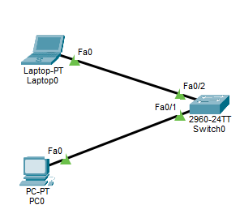
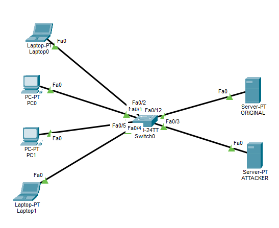

- There are two common DHCP attacks covered here:
	1. **DHCP Starvation**
	2. **DHCP Spoofing / Rogue DHCP Server**
# 1. DHCP Starvation
- DHCP Starvation is considered a **Denial of Service (DoS) attack**.
- **The goal is to make the DHCP server run out of available IP addresses.**
- Normally, the DHCP server gives an IP address to a client and keeps a lease that is connected to that client's MAC address.
- In a DHCP Starvation attack, **the attacker sends many DHCP requests while using many fake or changed MAC addresses**.
- The DHCP server thinks that every MAC address belongs to a different client.
- **The server keeps giving out IP addresses until the DHCP pool becomes full.**
- After the pool is full, **normal clients may not be able to get an IP address from DHCP**.
## 1.1 Simple DHCP Starvation Example
- Suppose the DHCP server has this pool: `192.168.1.10 - 192.168.1.50`
- That gives the DHCP server a limited number of addresses.
- A normal client may send:
```
DHCP Discover
MAC = AA:AA:AA:AA:AA:01
```
- The DHCP server may give it: `192.168.1.10`

- The attacker then sends many DHCP requests while pretending to use different MAC addresses:
```
MAC = AA:AA:AA:AA:AA:02
MAC = AA:AA:AA:AA:AA:03
MAC = AA:AA:AA:AA:AA:04
MAC = AA:AA:AA:AA:AA:05
```
- The DHCP server may keep giving addresses:
```
192.168.1.11
192.168.1.12
192.168.1.13
192.168.1.14
```
- Eventually, all available addresses may be used.

- Then a real client sends: `DHCP Discover` but the DHCP server has no free IP address to give it. So the client does not receive the required DHCP configuration.
### APIPA
- If a client cannot get an IP address from DHCP, it may automatically give itself an **APIPA** address.
- APIPA means **Automatic Private IP Addressing**.
- APIPA uses the block: `169.254.0.0/16`
- **An APIPA address can allow limited communication with devices on the same local link that also have compatible APIPA addresses.**
- **It normally cannot provide the normal network access that the DHCP configuration was supposed to provide.**
- For example:
	- Expected DHCP address: `192.168.1.20`
	- But DHCP fails, so the client may get something like: `169.254.20.15`
## 1.2 DHCP Starvation Mitigation

- Suppose there is a switch between the clients and the DHCP server like this topology.
- One way to reduce this attack is to use: `Port Security`
- **Port Security can limit how many MAC addresses are allowed to appear on a switch port.**
- For example: `PC -> Switch Port Fa0/1`
- If Fa0/1 is configured to allow only one MAC address, then an attacker cannot keep using a large number of different source MAC addresses through that port without causing a Port Security violation.
- Note : Port Security helps against DHCP Starvation, but it is not the only protection.
- Another useful protection is: `DHCP Snooping Rate Limiting` , It can limit how many DHCP messages are allowed on a port. This helps stop one client port from sending a very large number of DHCP requests.
### Port Security
- Port Security mainly controls:
	1. **Allowed MAC addresses**
	2. **Maximum number of MAC addresses**
	3. **What happens when there is a violation**
#### 1. Allowed MAC Address
- There are different ways to decide which MAC address is allowed.
##### Manual MAC Address
- You can manually tell the switch port which MAC address is allowed.
- Example:
```
Switch(config)#switchport port-security mac-address 0011.2233.4455
```
##### Sticky MAC Address
- You can use:
```
Switch(config)#switchport port-security mac-address sticky
```
- The switch learns the MAC address that arrives on the port and treats it as a secure MAC address.
- For example: 
	- `PC MAC: 0011.2233.4455`
	- The PC sends traffic through Fa0/1.
	- The switch learns: `Fa0/1 -> 0011.2233.4455`
- If the maximum MAC address allowed on this port is one, another MAC address on the same port will cause a Port Security violation.
#### 2. Maximum number of  MAC Addresses on Port
- The command is:
```
Switch(config)#switchport port-security maximum <number of MAC addresses allowed>
```

- For example:
```
Switch(config)#switchport port-security maximum 1
```
- means:
> Allow a maximum of one secure MAC address on this port.
- The default maximum is normally `1`.

- If you want to allow more than one MAC address, you can increase it.
- For example:
```
Switch(config)#switchport port-security maximum 2
```
- Now the port can learn or allow up to two secure MAC addresses.
#### 3. Port Security Violation Modes
- A violation happens **when the port sees a MAC address that is not allowed**, or **when the number of secure MAC addresses becomes greater than the configured maximum**.
- There are three common modes:
	1. **Shutdown**
	2. **Protect**
	3. **Restrict**
##### Shutdown
- Command:
```
Switch(config)#switchport port-security violation shutdown
```
- This is normally the **default violation mode**.
- If a violation happens, **the switch puts the port into an error-disabled state**, **Traffic** through the port **stops**.
- **Even the original allowed device cannot normally use the port while it is error-disabled.**
- The port **must be recovered** before normal traffic can continue.
##### Protect
- Command:
```
Switch(config)#switchport port-security violation protect
```
- The switch **does not shut down the whole port**.
- **Traffic** from allowed MAC addresses **can continue**.
- Frames from the violating MAC address are dropped.
- The port **stays up** if the original allowed device uses it.
##### Restrict
- Command:
```
Switch(config)#switchport port-security violation restrict
```
- The switch **does not shut down the whole port.**
- **Traffic** from allowed MAC addresses **can continue**.
- Frames from violating MAC addresses are dropped.
- **The switch also records the violation.**
- Depending on the device, it may increase the violation counter and generate log or SNMP messages.
- The main difference between `protect` and `restrict` is:
	- protect = drop violating traffic
	- restrict = drop violating traffic + record/report the violation


### Port Security Configuration

 - In this topology, clients are connected to: `FastEthernet 0/1` , `FastEthernet 0/2`
- We can configure:
```
Switch(config)# interface range fastEthernet 0/1-2
Switch(config-if-range)# switchport mode access
Switch(config-if-range)# switchport port-security
Switch(config-if-range)# switchport port-security maximum 1
Switch(config-if-range)# switchport port-security mac-address sticky
Switch(config-if-range)# switchport port-security violation shutdown
Switch(config-if-range)# exit
```
#### Why the Port is an Access Port?
- Port Security is normally configured on ports connected to end devices.
- It is not always limited to access ports, Some switches also support Port Security on trunk ports.
- The access port belongs to one VLAN and normally connects to a client device.
- So we first configure: `switchport mode access` and then enable Port Security.
### DHCP Snooping Rate Limit
- **DHCP Snooping can also limit the DHCP message rate on an untrusted access port.**
- Example:
```
Switch(config)# interface fastEthernet 0/1
Switch(config-if)# ip dhcp snooping limit rate 15
Switch(config-if)# exit
```
- This means the switch limits how many DHCP messages are accepted from that port **in a period of time**.
- This can help reduce DHCP Starvation attacks caused by one device sending a very large number of DHCP requests.
# 2. DHCP Spoofing / Rogue DHCP Server
- **DHCP Spoofing happens when an attacker places an unauthorized DHCP server on the network.**
- This unauthorized server is called a: `Rogue DHCP Server`.
- Now there may be two DHCP servers:
	- Original DHCP Server
	- Rogue DHCP Server
- Both servers may receive the client's DHCP Discover.
## 2.1 Simple DHCP Spoofing Example
- The client sends: `DHCP Discover`
- Both servers receive it:
```
    Client
      |
      | DHCP Discover
      |
      +--------------------+
      |                    |
      v                    v
    Original             Rogue
    DHCP Server          DHCP Server

```
- Both servers may send: `DHCP Offer`.
- The attacker tries to make the client accept the Rogue DHCP Server's offer by make the Rogue DHCP Server respond quickly. 
- It is not guaranteed that simply being faster always means the Rogue DHCP Server will win.
- If the client accepts the Rogue DHCP Server's offer, **the attacker can give the client incorrect network settings**.
- The Rogue DHCP Server does **not** have to use a completely different IP range.
- **It can give the client incorrect values such as:**
	- Wrong IP address
	- Wrong subnet mask
	- Wrong default gateway
	- Wrong DNS server
## 2.2 DHCP Spoofing Mitigation
- A common protection against Rogue DHCP Servers is: `DHCP Snooping`.
- Suppose the topology is:
```
    Clients
       |
       |
     Switch
       |
       |
    Original
    DHCP Server
```
- The switch can be configured **so that only trusted ports are allowed to receive DHCP server messages from the legitimate DHCP server**.
### DHCP Server Messages
- During DHCP DORA: Discover, Offer, Request, Acknowledgment.
- The **client** normally sends: Discover and Request.
- The DHCP server normally sends: Offer and ACK.
- A Rogue DHCP Server also tries to send server messages such as: Offer and ACK.
- **DHCP Snooping can block these DHCP server messages when they arrive on an untrusted port.**
### DHCP Snooping Ports
- DHCP Snooping normally treats switch ports as: 
	- **Trusted:** A trusted port is a port where legitimate DHCP server messages are allowed to enter the switch.
	- **Untrusted:** Client access ports are normally left untrusted.
- If an attacker connects a Rogue DHCP Server to one of these untrusted ports and sends a DHCP Offer, **DHCP Snooping can drop it**.

- **The trusted port is not always directly connected to the DHCP server.**
- For example:
```
    Client
      |
    Switch1
      |
    Switch2
      |
    DHCP Server
```
- On Switch1, the trusted port may be the uplink toward Switch2 because legitimate DHCP server replies come through that uplink.
- So the simple rule is:
> Trust the port through which legitimate DHCP server messages should enter the switch.
### DHCP Snooping Trust Ports

- **Configure the port connected toward the trusted DHCP server:**
```
Switch(config)# interface fastEthernet 0/12
Switch(config-if)# ip dhcp snooping trust
Switch(config-if)# exit
```
- Now: `Fa0/12 = trusted`, Other access ports remain **untrusted by default**.
### Creating a DHCP Server in Packet Tracer
- To make a server provide DHCP service in Packet Tracer:
1. Go to: `End Devices` and Add a: `Server`
2. Give the server a static IP address.
3. Open the server and Go to: `Services`
4. Select: `DHCP` and Turn the DHCP service `On`
5. Configure the DHCP pool.
	- For example:
	```
	Pool Name:      LAN1
    Default Gateway: 192.168.1.1
    DNS Server:      8.8.8.8
    Start IP Address: 192.168.1.10
    Subnet Mask:     255.255.255.0
    Maximum Users:   50
	```
6. Click: `Add` .
### Why Does the DHCP Server Need a Static IP?
- The DHCP server should have a fixed IP address because clients, routers, or DHCP Relays **need to know where the DHCP server is**.
- For example, if a router uses: `ip helper-address 192.168.1.2` , then the DHCP server should continue using: `192.168.1.2`
- If the server's IP kept changing, the router could send DHCP Relay messages to the wrong address, So a DHCP server normally uses a static IP address.