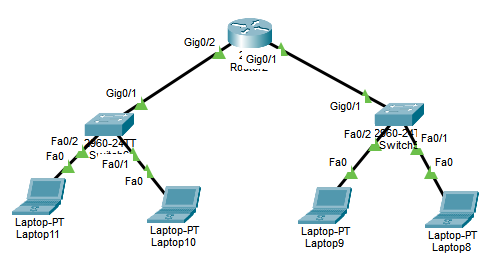
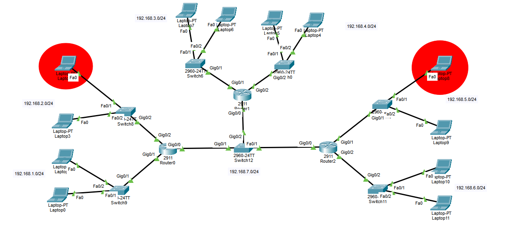
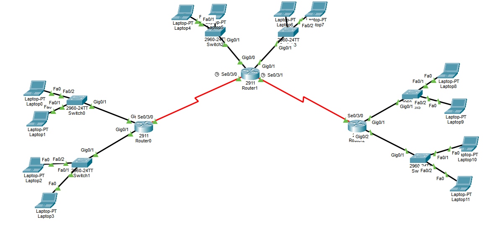

# Router Basics
- A **Router** connects two or more **LANs (Local Area Networks)** or **different subnets**.
- The router works as the **Default Gateway** between networks.
- Every end device (PC, Laptop, Server, etc.) must have a **Default Gateway** configured to communicate with devices outside its own subnet.
- The **Default Gateway** is the **IP address of the router interface** connected to that LAN.
- The gateway IP **must belong to the same subnet** as the devices using it.
## Example
Network:
```
192.168.1.0/24
```

Router Interface:
```
192.168.1.1
```

PC:
```
IP Address      : 192.168.1.10
Subnet Mask     : 255.255.255.0
Default Gateway : 192.168.1.1
```
## Choosing the Default Gateway
- Usually we use the **first usable IP** in the subnet (like `192.168.1.1`).
- It can actually be **any usable IP** inside the subnet.
- It **cannot** be:
	- Network ID
	- Broadcast Address
- All devices in the same subnet should use the **same default gateway**.
---
## One Router vs Multiple Routers

### One Router

If only **one router** connects all LANs:
- Assign IP addresses to all router interfaces.
- Configure the default gateway on end devices.
- The router automatically routes traffic between its directly connected networks.
- **No static or dynamic routing configuration is needed.**
### Multiple Routers
If there are **multiple routers** connected together (Point-to-Point links):
- Configure IP addresses on all interfaces.
- Then configure routing so each router knows how to reach remote networks.
- Routing can be:
	- Static Routing
	- Default Routing
	- Dynamic Routing
---
## Counting Subnets
To determine the number of subnets:
- Every LAN connected to a router interface is one subnet.
- A **Point-to-Point connection** between two routers is also **one subnet**, even though it uses two interfaces (one on each router).
Example:
```
Router0 -------- Router1
      192.168.7.0/24
```
This link is **one subnet**, not two.

---
# Types of Routing
There are two main routing methods:
- Static Routing
- Dynamic Routing
(Default Routing is actually a special type of **Static Routing**.)
---
# Static Routing
- Static Routing means you manually tell the router where every remote network is.
- It is simple but becomes difficult to manage in large networks.
---
## Router Configuration Notes
Most basic router configuration commands are exactly the same as on a switch:
- Hostname
- Banner
- Console Password
- VTY Password
- Enable Password/Secret
- SSH configuration

The main difference:
- Router interfaces are **Shutdown** by default, so you must enable them using:
```
no shutdown
```
- Switch ports are **enabled by default**.
---


# 1. Configure Router0 Interfaces

```
Router>en
Router#conf t

Router(config)#interface gigabitEthernet 0/0
Router(config-if)#ip address 192.168.7.1 255.255.255.0
Router(config-if)#no shutdown
Router(config-if)#exit

Router(config)#interface gigabitEthernet 0/1
Router(config-if)#ip address 192.168.1.1 255.255.255.0
Router(config-if)#no shutdown
Router(config-if)#exit

Router(config)#interface gigabitEthernet 0/2
Router(config-if)#ip address 192.168.2.1 255.255.255.0
Router(config-if)#no shutdown
Router(config-if)#exit
```

---
# 2. Configure Router1 Interfaces
```
Router>en
Router#conf t

Router(config)#interface gigabitEthernet 0/0
Router(config-if)#ip address 192.168.7.2 255.255.255.0
Router(config-if)#no shutdown
Router(config-if)#exit

Router(config)#interface gigabitEthernet 0/1
Router(config-if)#ip address 192.168.3.1 255.255.255.0
Router(config-if)#no shutdown
Router(config-if)#exit

Router(config)#interface gigabitEthernet 0/2
Router(config-if)#ip address 192.168.4.1 255.255.255.0
Router(config-if)#no shutdown
Router(config-if)#exit
```

---
# 3. Configure Router2 Interfaces
```
Router>en
Router#conf t

Router(config)#interface gigabitEthernet 0/0
Router(config-if)#ip address 192.168.7.3 255.255.255.0
Router(config-if)#no shutdown
Router(config-if)#exit

Router(config)#interface gigabitEthernet 0/1
Router(config-if)#ip address 192.168.5.1 255.255.255.0
Router(config-if)#no shutdown
Router(config-if)#exit

Router(config)#interface gigabitEthernet 0/2
Router(config-if)#ip address 192.168.6.1 255.255.255.0
Router(config-if)#no shutdown
Router(config-if)#exit
```

---
# 4. Configure End Devices
We will test connectivity between:
- Left laptop (Network 2)
- Right laptop (Network 6)

Assign:
- Left laptop
```
IP Address      : 192.168.2.2
Subnet Mask     : 255.255.255.0
Default Gateway : 192.168.2.1
```
- Right laptop
```
IP Address      : 192.168.6.2
Subnet Mask     : 255.255.255.0
Default Gateway : 192.168.6.1
```

Configure all other devices in the same way.

---
### Before Configuring Routing
Devices can communicate only with:
- Devices in the same LAN.
- Other LANs directly connected to their own router.

For example:
- Network 5 can reach Network 6 because Router2 is directly connected to both.
- Network 2 cannot reach Network 6 because Router0 doesn't know where Network 6 is.

---
- Shows router interface names, IP addresses, and status.
```
show ip interface brief
```
- Shows the routing table.
```
show ip route
```

Initially, each router only knows:
- Directly Connected Networks (C)
- Local Interface Addresses (L)

It does **not** know remote networks.

---
# 5. Static Route Syntax
```
ip route <Destination Network> <Subnet Mask> <Next-Hop IP>

or

ip route <Destination Network> <Subnet Mask> <Exit Interface>
```
### Next-Hop
The **Next-Hop** is the IP address of the **next router** that should receive the packet.

Example:
```
Router0 ---> Router1 ---> Router2
```

If Router0 wants to reach Network 5, the next hop could be Router2's interface (`192.168.7.3`).

---
### Exit Interface
Instead of specifying the next-hop IP, you can specify the interface the packet should leave from.

Example:
```
ip route 192.168.3.0 255.255.255.0 GigabitEthernet0/0
```

This tells the router:
> "Send packets for Network 3 out of interface GigabitEthernet0/0."

Using a **Next-Hop IP** is generally preferred on Ethernet networks because it allows proper ARP resolution and is easier to troubleshoot. Using an **Exit Interface** is common on Point-to-Point links.

---
# 6. Configure Routers' Routes 
## 6.1 Configure Router0 Routes
```
Router(config)#ip route 192.168.3.0 255.255.255.0 192.168.7.2
Router(config)#ip route 192.168.4.0 255.255.255.0 192.168.7.2
Router(config)#ip route 192.168.5.0 255.255.255.0 192.168.7.3
Router(config)#ip route 192.168.6.0 255.255.255.0 192.168.7.3
```

Example:
```
ip route 192.168.3.0 255.255.255.0 192.168.7.2
```
means:
- If a packet is going to **Network 3**, send it to Router1 (`192.168.7.2`).
- Router1 then forwards it to the final destination.
---
## 6.2 Configure Router1 Routes
```
Router(config)#ip route 192.168.1.0 255.255.255.0 192.168.7.1
Router(config)#ip route 192.168.2.0 255.255.255.0 192.168.7.1
Router(config)#ip route 192.168.5.0 255.255.255.0 192.168.7.3
Router(config)#ip route 192.168.6.0 255.255.255.0 192.168.7.3
```

---
## 6.3 Configure Router2 Routes
```
Router(config)#ip route 192.168.1.0 255.255.255.0 192.168.7.1
Router(config)#ip route 192.168.2.0 255.255.255.0 192.168.7.1
Router(config)#ip route 192.168.3.0 255.255.255.0 192.168.7.2
Router(config)#ip route 192.168.4.0 255.255.255.0 192.168.7.2
```

- Now every router knows how to reach every remote network.
- Devices in all six LANs can communicate.
---
# TTL (Time To Live)
TTL is a value inside every IP packet.
- It decreases by **1** every time the packet passes through a router (each router is one **hop**).
- If TTL reaches **0**, the router discards the packet.
- This prevents packets from looping forever because of incorrect routing.

Example:
```
Initial TTL = 64

Router1 -> 63
Router2 -> 62
Router3 -> 61
```

- TTL is chosen by the **sending operating system(response server)** (for example, Windows often starts with 128 and Linux with 64). You normally do **not** configure it for everyday networking.

To see how many hops a packet takes, use:
- Windows
```
tracert www.example.com
```
- Linux
```
traceroute www.example.com
```

---
# Default Routing

- Suppose Network 3 is replaced by a new Network 8. Will other routers know how to reach Network 8? **No.** Because static routes only know the networks you configured.
- Instead of creating a static route for every new network, you can configure a **Default Route**.

- A Default Route means:
> "If you don't know where to send the packet, send it to this next router."

## Syntax:

```
Router(config)#ip route 0.0.0.0 0.0.0.0 <next-hop-ip>

or

Router(config)#ip route 0.0.0.0 0.0.0.0 <exit-interface>
```

where:
```
0.0.0.0 0.0.0.0
```
means:
"Match every destination network."

---
## When Should You Use a Default Route?
Use a Default Route when a router has **only one path** to reach all unknown networks.

Example:
```
Branch Router ---- ISP
```

- The branch router has only one exit, so all unknown traffic is sent to the ISP.
- Your home router uses a Default Route toward your ISP.
---
## Why Doesn't Router1 Use a Default Route?
Router1 has **two possible directions**:
- Router0
- Router2

If Router1 had only one default route, packets might be sent the wrong way.

So Router1 normally uses **specific routes** (or a dynamic routing protocol).

---
# Serial Connection
To connect routers using Serial interfaces in Packet Tracer:
1. Open the router.
2. Go to the **Physical** tab.
3. Turn the router off.
4. Insert the **HWIC-2T** module.
5. Turn the router back on.
6. Connect the routers using a Serial cable.
---
# Serial DTE Cable vs Copper Straight-Through Cable

| Serial DTE Cable | Copper Straight-Through |
|------------------|-------------------------|
| Connects router to router (Serial interfaces). | Connects different Ethernet devices (PC-Switch, Switch-Router). |
| Used on WAN links. | Used on LANs. |
| Uses Serial interfaces. | Uses Ethernet interfaces (Fast/Gigabit Ethernet). |
| One side is DCE (provides clock rate), the other is DTE. | No clock rate is needed. |
| Slower than Ethernet. | Faster than Serial. |